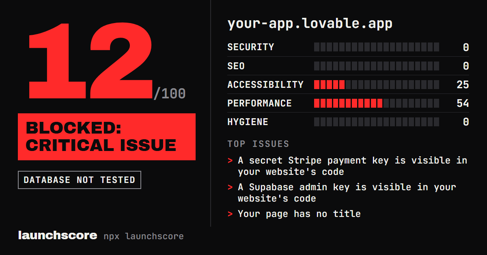

<p align="center">
  
</p>

<h1 align="center">launchscore</h1>

<p align="center">
  <b>Paste your URL. Find out if your vibe-coded app will get you hacked, sued, or ignored by Google.</b><br>
  One score out of 100, in plain English. Free, open source, and it runs on your own computer.
</p>

<p align="center">
  <a href="https://github.com/Kranthisai07/launchscore/actions/workflows/ci.yml"></a>
  <a href="LICENSE"></a>
  
  
  <a href="https://github.com/Kranthisai07/launchscore/stargazers"></a>
</p>

```bash
git clone https://github.com/Kranthisai07/launchscore && cd launchscore && pnpm install && npx playwright install chromium && pnpm dev https://your-site.com
```

> **Pre-release.** launchscore is not on npm yet, so `npx launchscore` does not work today. The line above runs it from source and needs [Node 22.19+](https://nodejs.org) and [pnpm](https://pnpm.io). The [roadmap](#roadmap) lists what is built and what is not.

<p align="center">
  
</p>

<sub>The demo above is the real output of a scan of this repo's built-in "bad" test site (planted problems), shown under a demo address.</sub>

## Why

You built an app with Lovable, Bolt, v0, Replit or Claude Code. It looks great. But apps built this way often ship with the same quiet problems:

- **Hacked:** a secret key left in the website's code, the original source code downloadable by anyone, missing browser safety settings.
- **Sued:** no privacy policy or terms link on a site that collects emails or passwords. (launchscore checks that the links exist. It is not legal advice.)
- **Ignored by Google:** no page title, a hidden "do not list me" tag, no sitemap, and the builder's default settings still in place.

Tools that read your source code are no use if you do not code. launchscore looks at your **live site**, the same way a visitor does, and tells you what to fix first, in words anyone can follow.

## Quick start

You need [Node 22.19 or newer](https://nodejs.org) and [pnpm](https://pnpm.io).

```bash
git clone https://github.com/Kranthisai07/launchscore
cd launchscore
pnpm install
npx playwright install chromium   # one time: the browser launchscore uses to load your site
pnpm dev https://your-site.com
```

The scan takes about 15 to 30 seconds, most of it the speed test.

| Option | What it does |
| --- | --- |
| `--no-perf` | Skip the speed test (slow on big sites). Performance then shows as "not tested". |
| `--open` | Open the web report in your browser when the scan finishes. |
| `--no-wait` | Do not wait for Enter at the end (scripts and CI never wait). |
| `-o, --out <folder>` | Write the files somewhere other than the current folder. |

Each scan writes four files:

| File | What it is |
| --- | --- |
| `launchscore-report.html` | The report to read. One page that works offline: your score, what to fix first and how, and what could not be checked. Fine on a phone. |
| `launchscore-report.json` | The same report as data, for tools. |
| `launchscore-card.png` | A 1200x630 share card for X and LinkedIn. |
| `launchscore-card-square.png` | A 1080x1350 version for Instagram. |

No site handy? Run `pnpm fixture good` (a clean site) or `pnpm fixture bad` (a site with planted problems). It prints a local address to scan. Press Ctrl+C to stop it.

## The share card

Every scan makes a card you can post. It shows the site name, the score, the verdict, one bar per area and the titles of the top issues. It never shows evidence, file paths or secrets.

<p align="center">
  
</p>

<sub>Made by launchscore's own card renderer from a scan of the "bad" test site, with the address swapped for a demo one. See <a href="scripts/make-card-example.ts">scripts/make-card-example.ts</a>.</sub>

## What it catches

19 checks run on every scan. All of them are passive: they only load your page and the files it points to, like any visitor.

| Area | What it looks for |
| --- | --- |
| Security | **SEC-001** Secret keys in your site's code (Stripe, OpenAI, Anthropic, AWS, GitHub, Supabase admin keys). Public keys are never flagged. |
| | **SEC-002** Source maps anyone can download, which hand over your original code. |
| | **SEC-003** Missing browser safety settings (security headers). One low finding that lists them. |
| | **SEC-004** No https, or no redirect from http to https. |
| | **SEC-005** Detects Supabase. Reported as a fact and never scored. |
| Search (SEO) | **SEO-001** Page title and description missing or badly sized. |
| | **SEO-002** Link preview tags missing (what your link looks like when shared). |
| | **SEO-003** No `robots.txt` or `sitemap.xml`. |
| | **SEO-004** An accidental "do not list this page" (noindex) tag. |
| | **SEO-005** No main heading, or a canonical link (the tag that tells Google your main address) that points at another site. |
| | **SEO-006** Your site builder's default settings still in place (Lovable). |
| Accessibility | **A11Y-001** Problems that make the site hard to use for some people, found with axe-core: missing image descriptions, faint text, unlabeled fields and buttons, tiny tap targets. |
| Performance | **PERF-001** Speed measured with Lighthouse (Google's speed tool) on a phone-sized setup, plus up to 3 speed tips. |
| Launch hygiene | **HYG-001** No privacy policy link (more serious if the page collects data). |
| | **HYG-002** No terms link. |
| | **HYG-003** Placeholder text left in: lorem ipsum, "John Doe", example.com emails. |
| | **HYG-004** No browser tab icon (favicon), or the starter icon from Vite, Next.js and others. |
| | **HYG-005** Errors in the browser console on load. |
| | **HYG-006** Broken links on your own site. |

Every finding comes with what it is, why it matters in one sentence, and how to fix it.

## Methodology

launchscore is built to be fair and to never cry wolf. A false alarm is worse than a miss, so when it is not sure, it reports less.

**Score.** The total is out of 100: a weighted average of five areas.

| Area | Weight |
| --- | --- |
| Security | 40 |
| Search (SEO) | 15 |
| Accessibility | 15 |
| Performance | 15 |
| Launch hygiene | 15 |

- Each area starts at 100. Every finding takes points off: **critical 60, high 30, medium 15, low 5**, never below 0.
- Performance is the exception: it uses the Lighthouse speed score as is, and its tips never take points off.
- **A critical issue blocks the launch.** The total is capped at 49 and the verdict is "BLOCKED: CRITICAL ISSUE", whatever else is fine.
- Otherwise: **90 or more is "READY TO LAUNCH"**, 70 to 89 is "ALMOST READY", below 70 is "NEEDS WORK".

**Honest about gaps.** An area that could not be tested shows "not tested", never a free 100, and the total only counts the areas that were tested. A scan with anything untested or skipped can never say "READY TO LAUNCH": the best it can say is "ALMOST READY".

**What counts as a finding.** Only real problems are scored. Facts about your stack (like "this site uses Supabase") are listed separately and never change the score. The full rules for each check, including the cases we deliberately do not report, are in [SPEC.md](SPEC.md). The reasons behind each change are in [DECISIONS.md](DECISIONS.md).

**Limits.** Scripts are read up to 5 MB per file, 25 MB in total and 500 files. Anything skipped is listed in the report and makes the scan partial.

## Tested on real sites

We picked 30 real public sites built with Lovable, Bolt and Vercel, plus personal sites. We ran launchscore on them and checked every finding by hand.

| Round | Right | Wrong | Not sure |
| --- | --- | --- | --- |
| 1 (8 sites) | 88 | 0 | 2 |
| 2 (22 sites listed, 20 scanned) | 221 | 4 | 1 |

All 4 wrong findings came from one check (placeholder text, HYG-003) and are fixed. The review also led to new checks (default builder settings, canonical host, placeholder tags) and fixes for pages that never finish loading. One site is skipped on purpose because its `robots.txt` asks bots to stay away. The scripts that run these rounds are in `scripts/` (`pnpm validate`, `pnpm validate:tally`).

These are our own numbers from our own review, not an independent audit.

## Safety

- **Passive only.** Today launchscore only loads your public page and the files it points to, the same as a visitor. It does not probe hidden paths or databases.
- **Gentle.** At most 5 requests at once to the site you scan.
- **Secrets stay hidden.** If a key is found, only the first 4 and last 4 characters are ever shown, in every output. The share cards never include evidence at all.
- **No tracking.** No telemetry. Nothing is sent anywhere except the requests to the site you chose to scan.
- **Only scan sites you own or have permission to scan.**

Checks that would look beyond the page (like testing whether a database is open to the public) are planned, and will only run on `localhost` or a domain you have proven you own.

## Roadmap

Built and working today:

- [x] 19 passive checks, scoring and verdicts
- [x] Plain-English web report, JSON report and two share cards
- [x] Calibrated on 30 real sites

Not built yet. Nothing below works today:

- [ ] `launchscore verify <domain>`: prove you own a domain (planned)
- [ ] Database test for Supabase (SEC-006) and exposed `/.env` and `/.git/config` files (SEC-007), only after verification
- [ ] Claude Code plugin that reads the report and fixes problems one at a time
- [ ] Fix guides for every check
- [ ] Publish to npm, so `npx launchscore <url>` works

## Contributing

Issues and pull requests are welcome. Please open an issue first for anything big.

```bash
pnpm install
pnpm test        # everything (needs Chromium)
pnpm test:unit   # no browser needed
pnpm typecheck
```

House rules:

- Every new check ships with a planted problem in `fixtures/bad` and a test that proves `fixtures/good` stays clean.
- False positives are worse than misses. When unsure, report less.
- Findings are written in plain English for non-coders. No unexplained jargon.
- Never print or store a full secret. Evidence always goes through `redact()`.
- Keep dependencies minimal. Ask first before adding one.

## Star history

<a href="https://star-history.com/#Kranthisai07/launchscore&Date">
  
</a>

## License

MIT, see [LICENSE](LICENSE). The share cards embed Archivo Black and JetBrains Mono under the SIL Open Font License 1.1, see [THIRD_PARTY_LICENSES.md](THIRD_PARTY_LICENSES.md).
